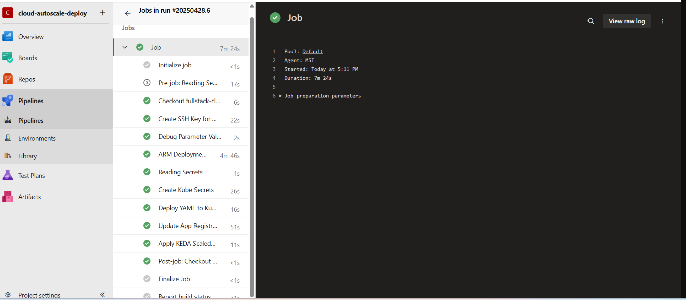
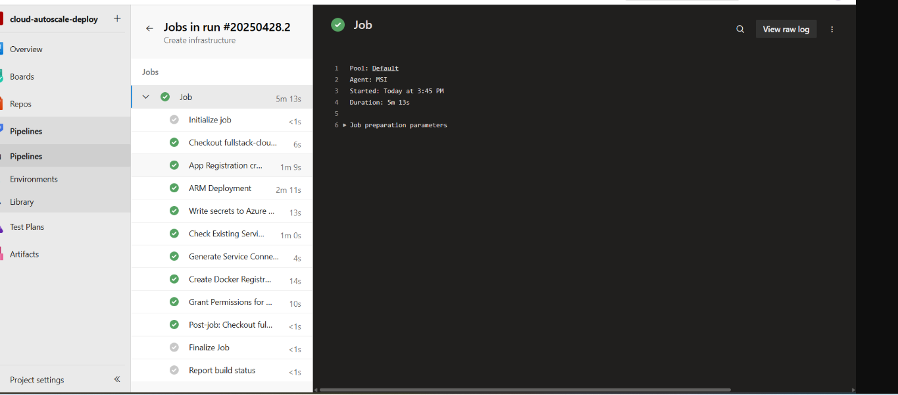
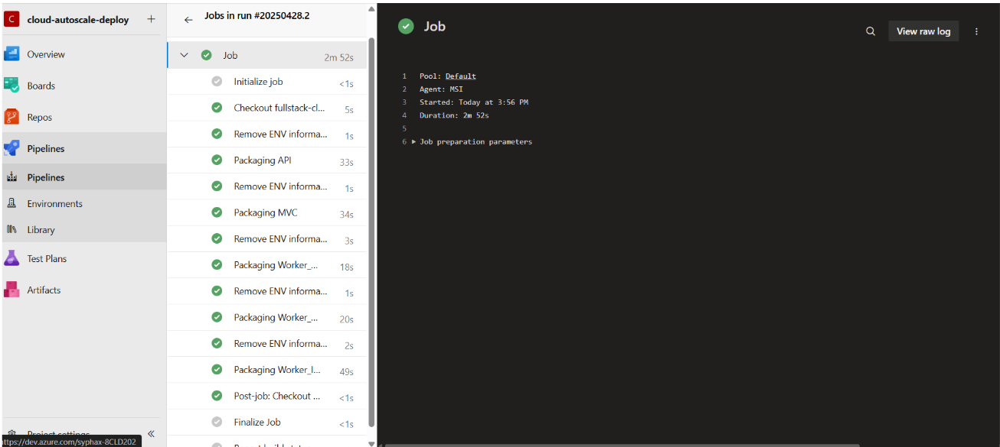
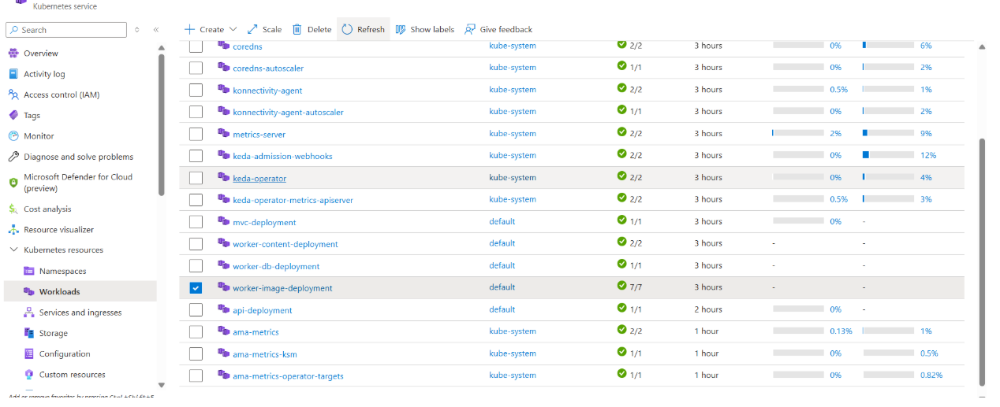

# Application de microservices .NET prête pour le cloud

Ce projet démontre le développement, la conteneurisation et le déploiement infonuagique d’une application basée sur une architecture de microservices en **.NET 9**, en utilisant **Azure** et **Kubernetes**.

## 🔧 Technologies

- **.NET 9** – Architecture microservices (API, MVC, Workers)
- **Docker** – Conteneurisation des services
- **Azure DevOps** – Pipelines CI/CD
- **AKS (Azure Kubernetes Service)** – Plateforme d’orchestration
- **KEDA** – Autoscaling basé sur des déclencheurs externes
- **Azure Key Vault** – Gestion sécurisée des secrets
- **CosmosDB** – Base de données NoSQL scalable
- **Azure Event Hub / Service Bus** – Architecture orientée événements
- **Azure Container Registry (ACR)** – Hébergement sécurisé des images Docker
- **Azure Monitor** – Supervision et journalisation
- **Azure App Configuration** – Gestion centralisée de la configuration

## 🧩 Vue d’ensemble de l’architecture

L’application se compose de :
- Une **API Gateway** pour l’accès externe
- Un **Frontend MVC** pour l’interaction utilisateur
- Plusieurs **services Worker** pour le traitement en arrière-plan
- Tous les services communiquent via HTTP et des messages asynchrones (Event Hub / Service Bus)

Chaque composant est conteneurisé et déployé sur AKS. KEDA ajuste dynamiquement le nombre de workers en fonction du volume d’événements.

## 🚀 Pipeline CI/CD

À l’aide des **pipelines Azure DevOps** :
1. **Construction** des images Docker pour chaque microservice
2. **Publication** des images dans **Azure Container Registry (ACR)**
3. **Déploiement** sur AKS à l’aide de manifestes Kubernetes et de charts Helm
4. Application des politiques d’autoscaling avec KEDA

## 🔐 Sécurité

- Les secrets (chaînes de connexion, clés API) sont stockés et récupérés de manière sécurisée via **Azure Key Vault**
- Les paramètres de configuration sont centralisés à l’aide de **Azure App Configuration**

## 📈 Supervision et tests

- Les journaux et métriques sont collectés via **Azure Monitor**
- Des tests de charge sont effectués avec des outils comme **Apache JMeter** ou **k6** afin de valider les performances et la montée en charge

## 📸 Déploiement réussi sur Azure

### ✔️ Pipeline Azure DevOps – Exécution complète

### ✔️ Création de l’infrastructure Azure

### ✔️ Packaging des microservices Docker

### ✔️ Déploiement et autoscaling sur AKS (KEDA)

